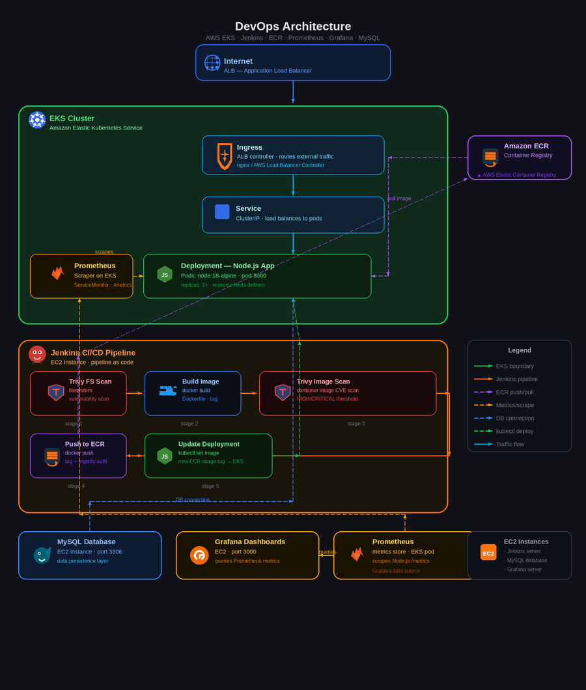

# CI/CD for NodeJS Application on EKS



## Overview

This repository implements a complete CI/CD workflow for a Node.js application running on AWS EKS. The solution includes a Dockerized Express app, automated Jenkins pipeline, Trivy security scanning, AWS ECR image registry, and Kubernetes manifests for deployment, service, and ALB ingress.

## Architecture

- Node.js application served on port `3000`
- MySQL connectivity via Kubernetes secrets
- Docker build and push to AWS ECR
- Jenkins pipeline for build, security scan, image publish, and EKS update
- Kubernetes resources for namespace, deployment, service, and ALB ingress

## Key Components

- `app.js` - Express application with database connectivity and health endpoint
- `Dockerfile` - Container image build definition
- `Jenkinsfile` - Jenkins pipeline for CI/CD automation
- `manifest/namespace.yaml` - Kubernetes namespace manifest
- `manifest/deployment.yaml` - Deployment configuration for the Node.js app
- `manifest/service.yaml` - ClusterIP service definition
- `manifest/ingress.yaml` - AWS ALB ingress route configuration

## Application Endpoints

- `GET /` - Renders a status page with the current database time
- `GET /health` - Returns JSON health status for Kubernetes probes

## Prerequisites

- Node.js and npm
- Docker
- AWS CLI configured for ECR and EKS
- `kubectl` configured for the target EKS cluster
- Jenkins access with credentials for GitHub, AWS, and Docker

## Local Run

```bash
npm install
DB_HOST=your-db-host \
DB_USER=your-db-user \
DB_PASSWORD=your-db-password \
DB_NAME=your-db-name \
npm start
```

Then visit `http://localhost:3000`.

## Docker Build

```bash
docker build -t ci-cd-nodejs-eks:latest .
```

## Jenkins Pipeline Overview

The `Jenkinsfile` workflow includes:

1. Git checkout
2. Dependency installation
3. Trivy filesystem scan
4. Docker image build
5. Trivy image scan
6. AWS ECR login and push
7. EKS kubeconfig update
8. Kubernetes deployment update
9. Rollout verification

## Kubernetes Deployment

The manifests deploy the application as:

- `Namespace`: `nodejs`
- `Deployment`: `nodejs-app` with 2 replicas
- `Service`: `nodejs-service` as `ClusterIP`
- `Ingress`: `nodejs-ingress` using AWS ALB

The deployment reads database credentials from a Kubernetes secret named `db-secret`.

## Environment Variables

Required environment variables:

- `DB_HOST`
- `DB_USER`
- `DB_PASSWORD`
- `DB_NAME`
- `PORT` (optional, defaults to `3000`)


